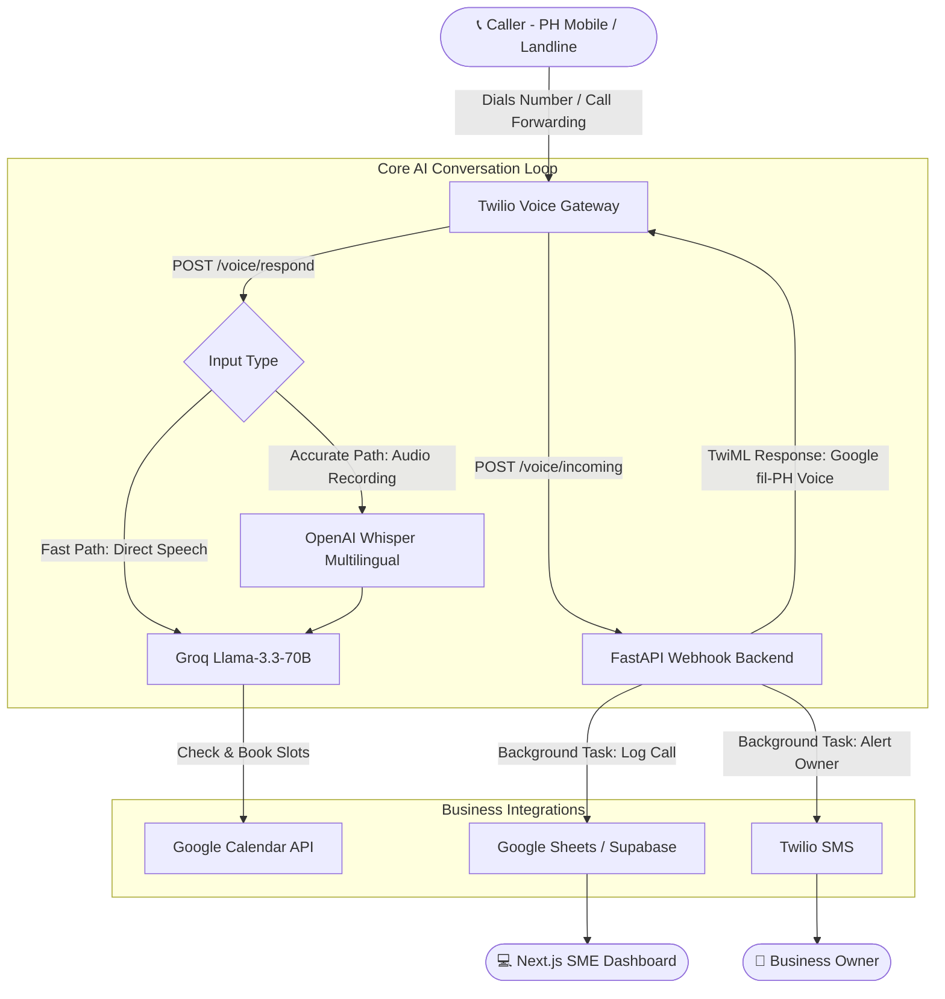

# 🇵🇭 SagotBot — AI Phone Receptionist for Philippine SMEs

[](https://www.python.org/)
[](https://fastapi.tiangolo.com)
[](https://www.twilio.com)
[](https://groq.com)
[](https://opensource.org/licenses/MIT)

> **"Never miss a client call again."**  
> SagotBot is a 24/7 AI-powered voice receptionist built specifically for Philippine clinics, salons, and restaurants. It natively understands and speaks **Tagalog, Bisaya, Taglish, and English**, answers customer FAQs, books appointments into Google Calendar, logs transcripts, and alerts business owners via SMS.

---

## 🏗 System Architecture



---

## ⚡ Key Features

1. **Ultra-Low Latency (<1.2s roundtrip):**
   - Utilizes Twilio's native Google Cloud Filipino WaveNet TTS (`Google.fil-PH-Wavenet-A`).
   - Eliminates external TTS API calls, MP3 encoding, and media storage upload steps.
2. **True Multilingual Support:**
   - Seamlessly switches between **Taglish** (*"Pwede po ba magpa-cleaning bukas?"*), **Bisaya** (*"Maayong adlaw, naa moy slot karong Biyernes?"*), and **English**.
   - Preserves polite Filipino customer service etiquette (*"po"* and *"opo"*).
3. **Multi-Turn Slot Filling:**
   - Automatically maintains conversational session context keyed by Twilio `CallSid`.
   - Progressively gathers service, preferred date, time, and patient name before confirming.
4. **Zero Dead Air Fallbacks:**
   - Graceful recovery prompts if line drops or speech is inaudible.
   - Fallback staff forwarding if caller requests a human operator.
5. **Multi-Tenant SaaS Ready:**
   - Isolated business configurations for Dental Clinics, Salons, and Restaurants.

---

## 🚀 Quickstart Guide

### 1. Prerequisites
- Python 3.11+
- Twilio Account (Account SID + Auth Token + Voice Number)
- Groq Cloud API Key ([console.groq.com](https://console.groq.com))
- ngrok (for local webhook tunneling)

### 2. Installation
```bash
# Clone the repository
git clone https://github.com/your-username/SagotBot.git
cd SagotBot/backend

# Create virtual environment
python -m venv .venv

# Activate virtual environment
# Windows:
.venv\Scripts\activate
# Mac/Linux:
source .venv/bin/activate

# Install dependencies
pip install -r requirements.txt
```

### 3. Configure Environment Variables
Copy `.env.example` to `.env`:
```bash
cp .env.example .env
```
Update your credentials:
```env
TWILIO_ACCOUNT_SID=ACxxxxxxxxxxxxxxxxxxxxxxxxxxxxxxxx
TWILIO_AUTH_TOKEN=your_twilio_auth_token_here
TWILIO_PHONE_NUMBER=+1234567890
GROQ_API_KEY=gsk_xxxxxxxxxxxxxxxxxxxxxxxxxxxxxxxxx
BUSINESS_NAME="Smiles Dental Clinic"
BUSINESS_TYPE="dental"
OWNER_PHONE_NUMBER="+639171234567"
```

### 4. Run the Backend Server
```bash
uvicorn app.main:app --host 0.0.0.0 --port 8000 --reload
```
Check health: `http://localhost:8000/health`

### 5. Expose Webhook via ngrok
In a separate terminal:
```bash
ngrok http 8000
```
Copy the HTTPS forwarding URL (e.g. `https://xyz123.ngrok-free.app`).

### 6. Connect to Twilio Voice
1. Open your **Twilio Console** → **Phone Numbers** → **Manage** → **Active Numbers**.
2. Select your Twilio phone number.
3. Under **Voice & Fax** → **A CALL COMES IN**:
   - Set to: `Webhook`
   - URL: `https://xyz123.ngrok-free.app/voice/incoming`
   - Method: `HTTP POST`
4. Under **CALL STATUS CHANGES**:
   - URL: `https://xyz123.ngrok-free.app/voice/status`
   - Method: `HTTP POST`
5. Click **Save Configuration**.

---

## 🧪 Testing

Run automated tests:
```bash
pytest
```

Simulate an incoming phone call via `cURL`:
```bash
curl -X POST "http://localhost:8000/voice/incoming" \
     -d "CallSid=CA_test_123" \
     -d "From=+639171234567" \
     -d "To=+1234567890"
```

---

## 💼 Business Model for Philippine SMEs
- **Setup Fee:** ₱3,000 – ₱5,000 (one-time onboarding, FAQ configuration)
- **Monthly Retainer:** ₱1,500 – ₱3,000 / month
- **Target Niches:** Dental Clinics, Hair & Aesthetic Salons, Dermatology, Boutique Restaurants
